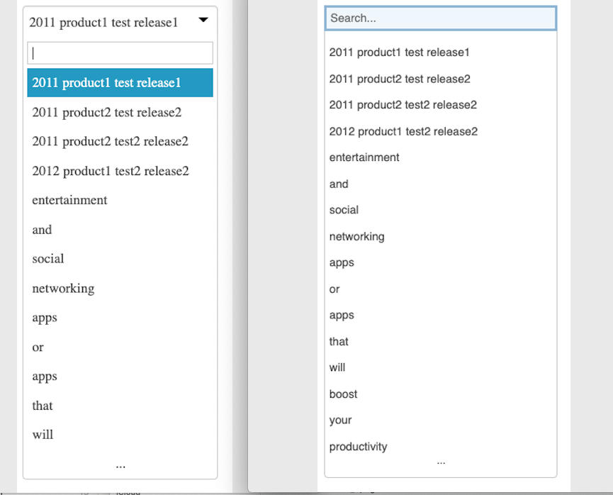

# Searchable Select

# What Changed



```
1.remove searchable-select-holder, only keep input 

2.add fuzzy search: split input content by space

3.if selected item's value is None, end it

4.change mouse event from click to mousedown: won't hide list when select all in input with mouse and mouse up at out of input

5.when input is cleared, remove selected item last time

6.changed some css

```


# How to use

```html
<select>
  <option value="name1">2011 product1 test release1</option>
  <option value="name2">2011 product2 test release2</option>
  <option value="name3">2011 product2 test2 release2</option>
  <option value="name4">2012 product1 test2 release2</option>
  <option value="entertainment">entertainment</option>
  <option value="and">and</option>
  <option value="social">social</option>
  <option value="networking">networking</option>
  <option value="apps">apps</option>
  <option value="or">or</option>
  <option value="apps">apps</option>
  <option value="that">that</option>
  <option value="will">will</option>
  <option value="boost">boost</option>
  <option value="your">your</option>
  <option value="productivity">productivity</option>
  <option value="Download">Download</option>
  <option value="or">or</option>
  <option value="buy">buy</option>
  <option value="apps">apps</option>
  <option value="from">from</option>
  <option value="Afbb">Afbb</option>
  <option value="Akademie">Akademie</option>
  <option value="Berlin">Berlin</option>
  <option value="reviews">reviews</option>
  <option value="by">by</option>
  <option value="real">real</option>
</select>
```

You need script like this:


```javascript
<script>
  $(function(){
    $('select').searchableSelect();
  });
</script>
```

# Author

David Qin